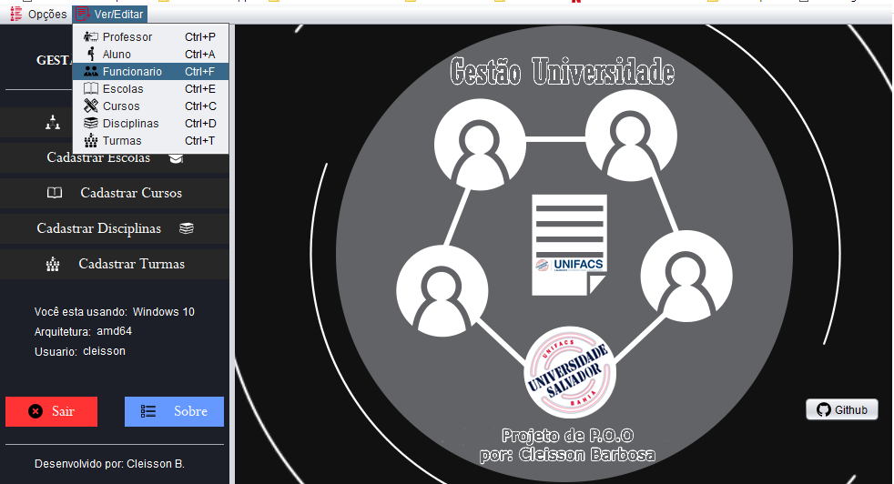
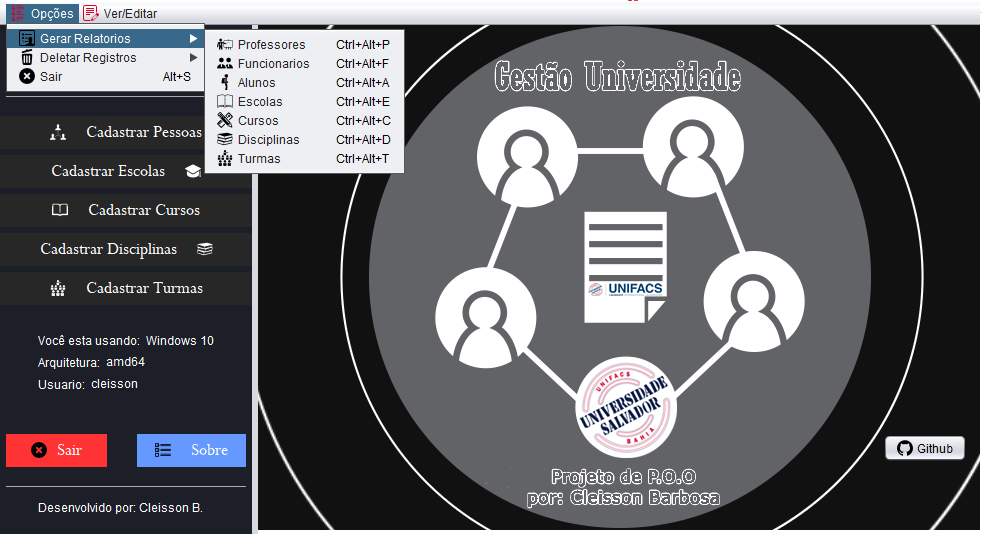
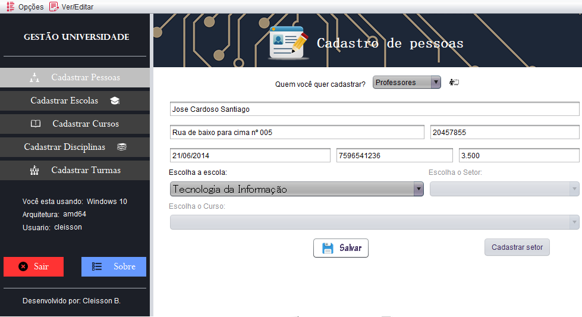
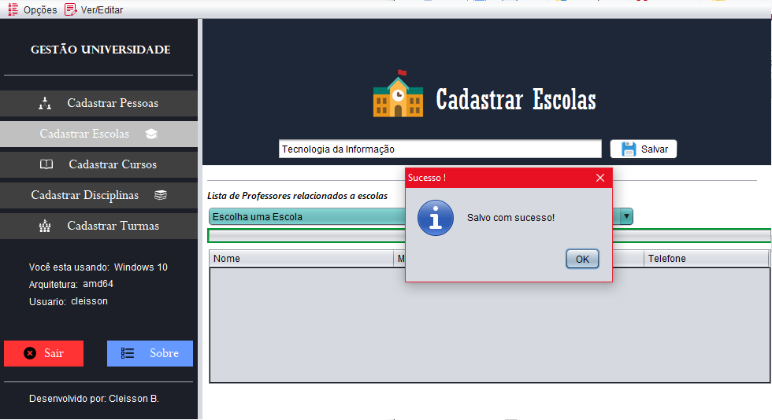
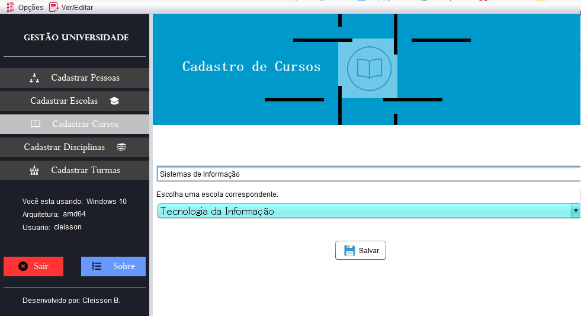
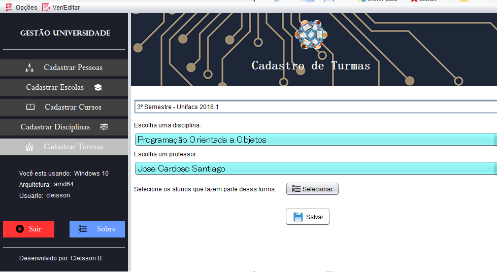
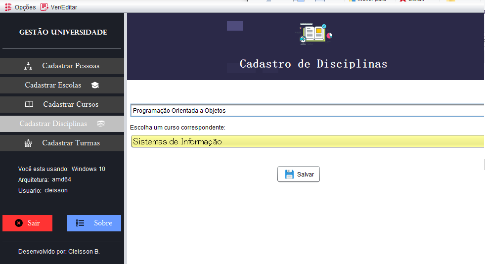
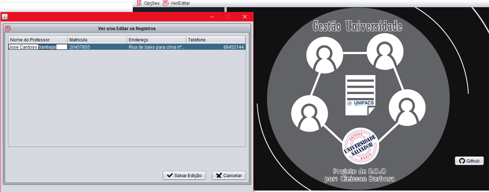

# GestaoFacul
Projeto da disciplina de Programação Orientada a Objetos

### Como compilar o projeto

A seguir passos necessarios para compilar o projeto utilizando a IDE Netbeans 8.2

* ¹Primeiramente clone o projeto para o netbeans.
* ²Adicione as dependencias da pasta [lib](lib)
### Bibliotecas externas utilizadas

* [itext PDF](https://github.com/itext/itextpdf)
* [Gson Google](https://github.com/google/gson)

#### Conceitos de P.O.O
Utilizando conceitos de P.O.O
```
1 //Classe Super Abstrata
2 abstract public class Pessoa{
3      ..... Contexto
4 }
```

## Screenshot's
#### Home + Menu Ver/Editar:


#### Menu Opções:


#### Cadastro de pessoas


#### Cadastro de Escolas


#### Cadastro de Cursos:


#### Cadastro de Turmas:


#### Cadastro Disciplinas:


#### Tela Ver ou Editar Registros:


## License

Este projeto esta sob a  [GNU General Public License v3.0](LICENSE) clique no arquivo para mais detalhes
